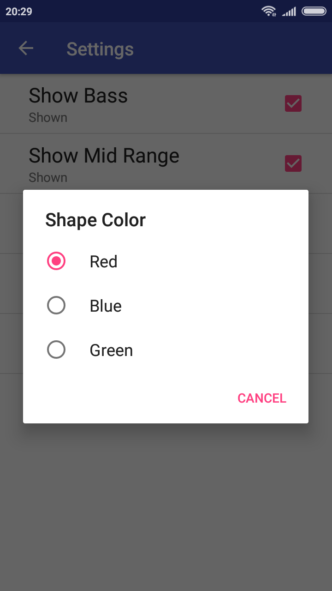

# Android-Visualizer
This app draws a graphic visualizer that displays the bass, range and quality of any given song fed into the app.
The user has the option of toggling between any of these characteristics and modifying the degree of animation of the visualizer.

## Screenshots
       

## Demo

## Technical Details
* Makes use **PreferenceFragment** for changing and saving settings.
  * Makes use of 3 **CheckBoxPreference** for enabling/disabling bass, mid-range and treble.
  * Makes use of **EditTextPreference** for setting the size using user input.
  * Makes use of **ListPreference** for changing color of the visualizer.

## Video Demo
Demo Video Of The App: https://youtu.be/llxP5SZUL1U
